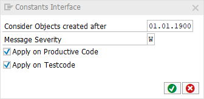

# code pal for ABAP

[code pal for ABAP](../../README.md) > [Documentation](../check_documentation.md) > [Constants Interface Check](constants-interface.md)

## Constants Interface Check

### What is the Intent of the Check?

You should always prefer [enumeration](https://github.com/SAP/styleguides/blob/master/clean-abap/CleanABAP.md#prefer-enumeration-classes-to-constants-interfaces) classes to/over constants interfaces.

```abap
CLASS /clean/message_severity DEFINITION PUBLIC ABSTRACT FINAL.
  PUBLIC SECTION.
    CONSTANTS:
       error        TYPE symsgty VALUE 'E',
       warning      TYPE symsgty VALUE 'W', 
       notification TYPE symsgty VALUE 'N'.
ENDCLASS.
```
or even
```abap
CLASS /clean/message_severity DEFINITION PUBLIC CREATE PRIVATE FINAL.
  PUBLIC SECTION.
    CLASS-DATA:
      error        TYPE REF TO /clean/message_severity READ-ONLY,
      warning      TYPE REF TO /clean/message_severity READ-ONLY,
      notification TYPE REF TO /clean/message_severity READ-ONLY.
  " ...
ENDCLASS.
```

### How does the check work?

The check searches for interfaces containing only constants.

### Which attributes can be maintained?



### How to solve the issue?

Use enumeration classes instead.

### What to do in case of exception?

In special cases, it is possible to suppress a finding by using the pseudo comment `"#EC CONS_INTF`.  
The pseudo comment must be placed right after the class definition header.

### Example

```abap
INTERFACE interface_name.   "#EC CONS_INTF
    CONSTANTS two TYPE i VALUE 2.
ENDINTERFACE.
```

### Further Readings & Knowledge

* [ABAP Styleguides on Clean Code](https://github.com/SAP/styleguides/blob/master/clean-abap/CleanABAP.md#prefer-enumeration-classes-to-constants-interfaces)
