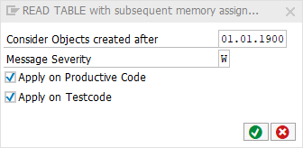

[BACK](../check_documentation.md)

# Subsequent Memory Assign Read Table Check
## What is the Intent of the Check?
The Subsequent Memory Assignment in Read Table check aims to prevent undesired changes to internal tables using field symbols in context of the `READ TABLE` statement with `INTO` instead of `ASSIGNING`.

## How does the check work?
This check finds `READ TABLE` statements which use statement `INTO` for assignment but using a field symbol instead of a variable.

## Which attributes can be maintained?


## How to solve the issue?
Use `ASSIGNING` instead of `INTO` in combination with field symbols as otherwise the selected table row will be overwritten.

## What to do in case of exception?
You can suppress Code Inspector findings generated by this check using the pseudo comment `"#EC SUB_ASSIGN`. The pseudo comment must be placed after the closing dot of the `READ TABLE` statement.

### Example
```abap
READ TABLE itab ASSIGNING FIELD-SYMBOL(<fs>) WHERE key = '1'.
" Do something with <fs>

READ TABLE itab INTO <fs> WHERE key = '2'.    "#EC SUB_ASSIGN
" Do something with <fs>
```
