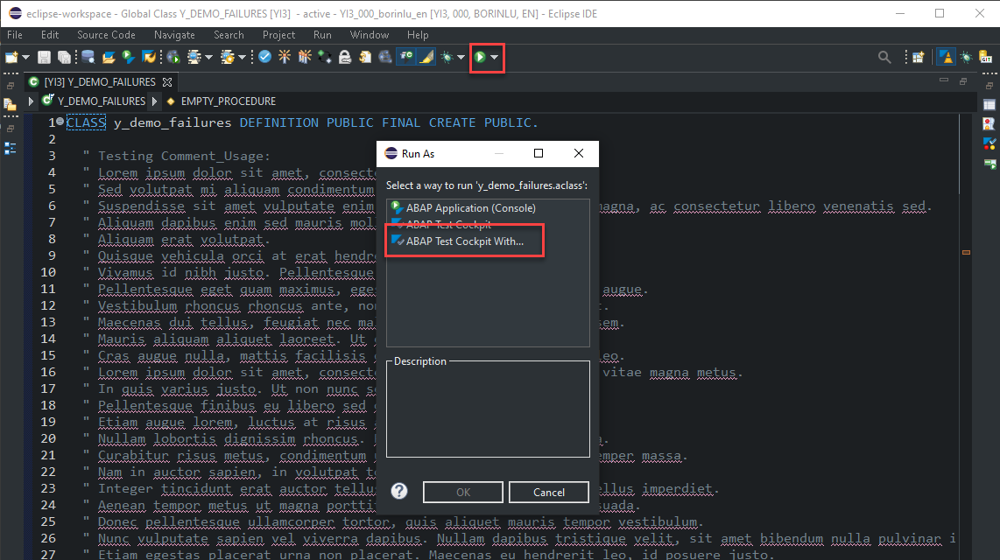

# Code Pal for ABAP

[Code Pal for ABAP](../README.md) > [How to Execute](how-to-execute.md)

## How to Execute

You can simulate the checks using the provided `Y_DEMO_FAILURES` class (delivered along with the tookit).

### SAP GUI

It is possible to execute the "code pal for ABAP checks" against your objects via:

1. `Code Inspector` (transactions SCI and SCII);
2. `ABAP Test Cockpit (ATC)` in CI-mode by informing a check variant. (in most of the ATC transactions/interfaces as usual; e.g.: SE80 --> right mouse-click --> Check --> ABAP Test Cockpit (ATC) with...); hereby is ADT (Eclipse) also supported.
3. `SUT - ABAP CHECK REPORT` running with in a CI-mode (flavour) and also informing a check variant;  

#### Executing via ABAP Test Cockpit (ATC)

In the tab `Options`, you have to inform your global check variant:  

#### Executing via Code Inspector (CI)

Start the transaction `SCI` or `SCII`, inform the object selection as well as a global check variant (for instance, you could provide the global variant `Y_CODE_PAL` which is a preset variant containing all existing checks and delivered along with the toolkit).

### Executing via Eclipse (ADT)

Select `Run As` > `ABAP Test Cockpit With...` and inform a global check variant (for instance, you could provide the global variant `Y_CODE_PAL` which is a preset variant containing all existing checks and delivered along with the toolkit).

### Executing via SUT (ABAP CHECK REPORT)

Start the transaction: `SUT` and call the program: `ABAP CHECK REPORT`. Then, inform the object selection as well as a global check variant (for instance, you could provide the global variant `Y_CODE_PAL` which is a preset variant containing all existing checks and delivered along with the toolkit).

